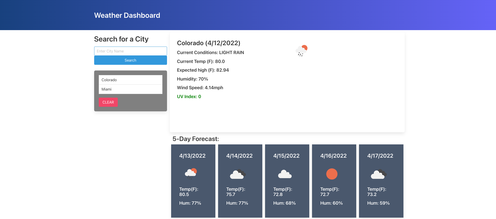

# weather-app
Weather app

## Project Description
This is a daily weather app so that an individual can search of the desired city.
## Link
-[weather-app Repo](https://github.com/juanestuniga/weather-app.git)

-[Live](https://juanestuniga.github.io/weather-app/) 

## Screenshots

## Built With
-HTML 

-CSS

-JS

## Credits

-[Website](https://stackoverflow.com/)

-[Website](https://www.w3schools.com/)

-[Website](https://developer.mozilla.org)

-[Website](https://www.codegrepper.com/)

-[Website](https://openweathermap.org/)